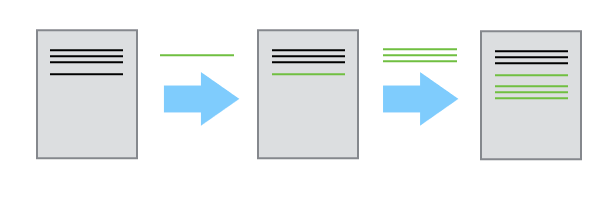
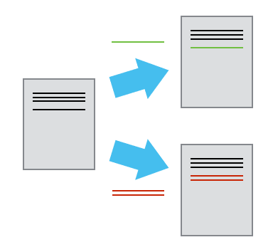

# Version Control with Git

*Nik Hartman*  
*Manfra Lab group meeting -- July 24 2019*

## Setup

* Bring a laptop. (I'm working under the assumption that everyone has a Windows machine.)
* Know how to open the Windows Command Prompt or PowerShell
* **Install Git** for Windows: https://git-scm.com/book/en/v2/Getting-Started-Installing-Git
* Editors (4 suggestions, make sure at least one is installed):
  * Vim – It’s everywhere. If you want to edit plain text from the command line, this is your best bet. There is a *steep* learning curve. **Vim can be installed along with Git. Do it.**
  * Emacs – The mortal enemy of vim. I don’t like it. Lots of people do. Don’t @ me.
  * Notepad++ -- an editor with a nice GUI made specifically for Windows. This is how I learned to program.
  * **Atom** – Editor made by the people at GitHub for all platforms. Modern features, integrates well with Git. Personal favorite. I use it throughout this tutorial.

## Why do we need version control?

- Version control is like an unlimited ‘undo’
- Version control also allows many people to work in parallel

This is possible with tools like 'track changes', but once changes are accepted, some history is lost. Tools like Dropbox will store multiple versions automatically (for $$$), but with no means of comparison or labelling beyond timestamps.

That leaves a situation like:



Version control gives us a way out of this mess (if you get that old bald guy to learn how to use it as well). This tutorial will focus on `git`, which is by far the most popular version control software in use today.

## Basic usage

* A folder (**repository**) is labelled for version control. All documents and subfolders within can be tracked for changes.
* Each change to a document is recorded independently (**commit**) by storing the difference (**diff**) between the current and previous version.

* The history can be split into two different versions (**branches**) each of which will be tracked independently. This feature allows collaborators to work simultaneously or multiple ideas to be tested in parallel.

* You can incorporate (**merge**) two sets of changes into the same base document. Attempting to merge conflicting changes will prompt user to choose between conflicting versions of text (more later). In general, Git is very smart about resolving complicated merge commands. [See this blog post for a summary](https://blog.jcoglan.com/2017/02/12/the-myers-diff-algorithm-part-1/).


## Setup Git

Here I assume you have already installed `git` on Windows. The first part of the setup is to set your user information, so that `git` knows who is making changes to the repositories.

```
> git config --global user.name "Vlad Dracula"
> git config --global user.email "vlad@tran.sylvan.ia"
```

This will set the user nameand email for all repositories on your computer. Not recommended on a lab computer.  

Next we will set up rules for line endings. In Windows new line characters are carriage return + line feed (`CRLF` or `\r\n`). On Unix systems a new line is `LF` (or `\n`) only. Version control should be agnostic to this. Set Git on Windows machine to checkout line endings as `CRLF` but commit line endings as `LF`.

```
> git config --global core.autocrlf true
```

Finally, we can set the default text editor. This editor will be automatically called when a commit message is needed or a merge conflict needs to be solved. Here I suggest `Atom`, unless you already know `vim`.

```
> git config --global core.editor “atom --wait”
```

To check the configuration of `git` on your machine, the following two commands are useful to check settings and get help, respectively

```
> git config --list
```
```
> git config --help
```

## Creating a repository

Now that `git` is installed and setup, create a repository in a folder on the Desktop and navigate into it.

```
> cd %USERPROFILE%\Desktop
> mkdir planets
> cd planets
```

Use `dir` to list the contents of the folder. Should only contain `.` and `..`

Now initialize a `git` repository (**repo**) in the folder.

```
git init
```
Check again what is in the folder with `dir`. Still nothing. Check one more time with `dir /a`. You should see a hidden folder called `.git`. This folder will contain all of the version history information for the repository (commits, branches, ...).

## Tracking changes

Now to create some content and track changes to it.

```
atom mars.txt
```
Atom should open with a blank document titled `mars.txt`. Add some text to that document and save it.

Now use `dir` in the command line to check the file exists and is not empty. To print the contents, use `type mars.txt`.

Check the status of the git repository:

```
git status
```

This should give some information that there is an untracked file. Add the file explicitly;

```
git add mars.text
```

Or, use a wildcard to add all files:

```
git add .
```

Now check `git status` again. The file is being tracked, but no changes/history have been committed.

```
git commit -m "start notes on Mars"
```

This takes all changes that were added in the `git add` command and stores a copy inside `.git`. Each copy committed has a unique identifier (see command line output).

The `-m` flag (for message) is a short explaination (to future you) describing the changes.

Another `git status` after the commit shows no untracked changes. `git log` will show

