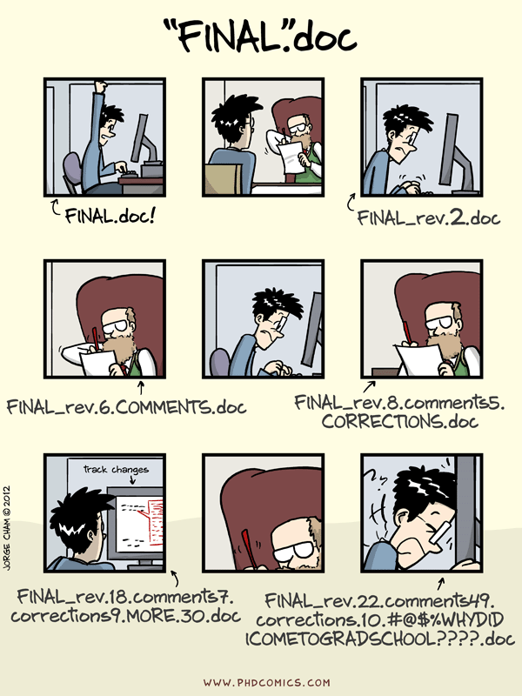
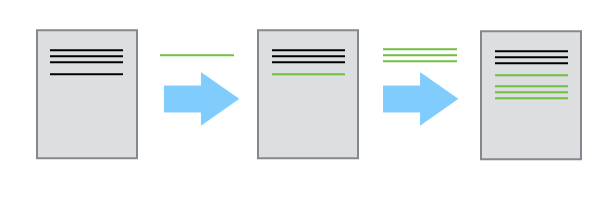
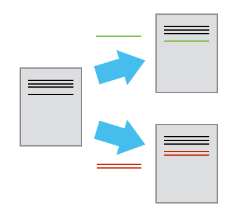
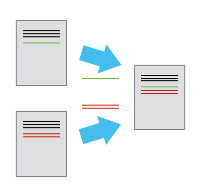
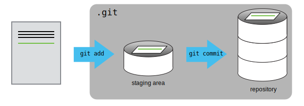

# Version Control with Git

*Nik Hartman*  
*Manfra Lab group meeting*

## Setup

* Bring a laptop. (I'm working under the assumption that everyone has a Windows machine.)
* Know how to open the Windows Command Prompt or PowerShell
* **Install Git** for Windows: https://git-scm.com/book/en/v2/Getting-Started-Installing-Git
* Popular editors:
  * Vim – If you want to edit plain text from the command line, this is your best bet. There is a *steep* learning curve. **Vim can be installed along with Git. Do it.**
  * Emacs – The mortal enemy of vim. I don’t like it. Lots of people do. Don’t @ me.
  * Notepad++ -- An editor with a nice GUI made specifically for Windows. This is how I learned to program.
  * **Atom** – Editor made by the people at GitHub for all platforms. Modern features, integrates well with Git, LaTex/Markdown previews, and lots of other plugins. Personal favorite. I use it throughout this tutorial.

## Why do we need version control?

- Version control is like an unlimited ‘undo’
- Version control also allows many people to work in parallel

This is possible with tools like 'track changes', but once changes are accepted, some history is lost. Tools like Dropbox will store multiple versions automatically (for $$$), but with no means of comparison or labelling beyond timestamps.

That leaves a situation like:



Version control gives us a way out of this mess (if you get that old bald guy to learn how to use it as well). This tutorial will focus on `git`, which is by far the most popular version control software in use today.

## Basic usage

* A folder (**repository**) is labelled for version control. All documents and subfolders within can be tracked for changes.
* Each change to a document is recorded independently (**commit**) by storing the difference (**diff**) between the current and previous version.



* The history can be split into two different versions (**branches**) each of which will be tracked independently. This feature allows collaborators to work simultaneously or multiple ideas to be tested in parallel.



* You can incorporate (**merge**) two sets of changes into the same base document. Attempting to merge conflicting changes will prompt user to choose between conflicting versions of text (more later). In general, Git is very smart about resolving complicated merge commands. [See this blog post for a summary](https://blog.jcoglan.com/2017/02/12/the-myers-diff-algorithm-part-1/).



## Setup Git

Here I assume you have already installed `git` on Windows. The first part of the setup is to set your user information, so that `git` knows who is making changes to the repositories.

```
> git config --global user.name "Nik Hartman"
> git config --global user.email "nik.hartman@gmail.com"
```

This will set the user name and email for all repositories on your computer. Not recommended on a lab computer.

Next we will set up rules for line endings. In Windows, new lines are two characters, carriage return + line feed (written `CRLF` or `\r\n`). On Unix systems, a new line is a line feed character only (`LF` or `\n`) only. Version control should be agnostic to this. Set Git on Windows machine to checkout line endings as `CRLF` but commit line endings as `LF`.

```
> git config --global core.autocrlf true
```

Finally, we can set the default text editor. This editor will be automatically called when a commit message is needed or a merge conflict needs to be solved. Here I suggest `Atom`, unless you already know `vim`.

```
> git config --global core.editor “atom --wait”
```

To check the configuration of `git` on your machine, the following two commands are useful to check settings and get help, respectively

```
> git config --list
```
```
> git config --help
```

## Creating a repository

Now that `git` is installed and setup, create a repository in a folder on the Desktop and navigate into it.

```
> cd %USERPROFILE%\Desktop
> mkdir planets
> cd planets
```

Use `dir` to list the contents of the folder, which should only contain `.` and `..`

Initialize a `git` repository (**repo**) in the `planets` folder.

```
git init
```
Check again what is in the folder with `dir`. Still nothing. Check one more time with `dir /a`. You should see a hidden folder called `.git`. This folder will contain all of the version history information for the repository (commits, branches, ...).

----
##### What if I screwed this up?

Delete the `.git` folder. Try again.

```
> rmdir /s .git
```
----

## Tracking changes

Now to create some content and track changes to it.

```
atom mars.txt
```
Atom should open with a blank document titled `mars.txt`. Add some text to that document and save it.

Now use `dir` in the command line to check the file exists and is not empty. To print the contents, use `type mars.txt`.

Check the status of the git repository:

```
git status
```

This should give some information that there is an untracked file. Add the file explicitly;

```
git add mars.txt
```

Or, use a wildcard to add all files:

```
git add .
```

Now check `git status` again. The file is being tracked, but no changes/history have been committed.

```
git commit -m "start notes on Mars"
```

This takes all changes that were added in the `git add` command and stores a copy inside `.git`. Each copy committed has a unique identifier (see command line output).

The `-m` flag (for message) is a short explaination (to future you) describing the changes.

Another `git status` after the commit shows no untracked changes. `git log` will show a history of the work/commits so far.

The idea is to add changes to the staging area, check them, then commit them.



Practically, there are some shortcuts for this that save all the add steps...

Make another change to `mars.txt`. Add the change with `git add mars.txt`. Check the staged changes with `git diff --staged`. `git diff` has a lot of useful features for displaying changes (so does Atom), check the help pages. And finally, commit the changes `> git commit -am "edits to mars notes"`.

That's a lot to do every time. You can shorten this by adding all changes at once `git add .`. You can skip the `git diff` step, if you feel confident you remember what you changed (you can go back later). Even better, you can do all of this in one line...

```
git commit -am "edits to mars notes"
```

The `-a` flag will add all changes to the repository. This is how I work all the time. I don't know anyone who looks at every diff and commits every file individually (unless you get into trouble).

##### Important points:

* git status shows the status of a repository.
* Files can be stored in a project’s working directory (which users see), the staging area (where the next commit is being built up) and the local repository (where commits are permanently recorded).
* git add puts files in the staging area.
* git commit saves the staged content as a new commit in the local repository.
* Write a commit message that accurately describes your changes.

## Exploring history

There is a lot to this. I recommend using a GUI (either Atom, GitHub, or DevOps). Using `git diff` in the command line can be cumbersome and confusing if you aren't used to it.


### Recovering Older Versions of a File

Again, using a GUI here might be helpful. The workflow is something like this...

1. You screw up and want to recover an old version
2. List old commits with `git log`
2. Use `git diff` (or your favorite GUI) to compare old versions. Versions are identified either by unique ID (like `fab23b`) or `HEAD` (where `HEAD` is the last commit `HEAD~1` is the one before that and so on).
3. Recover changes with one of the following commands
```
> git checkout HEAD mars.txt
> git checkout <unique ID of last commit> mars.txt
```
This will checkout an old version of `mars.txt`. From here you can add and commit more changes as usual.

If you run `checkout` without specifying a file, you'll be put into a "detached HEAD" state, where you can look around but not save changes. From this state you can create a new branch based on the commit you checked out `git checkout -b <new-branch-from-old-commit>`.

In addition to checking out old versions from commits, you can use `revert` to roll undo a previous commit. If you start with state `a` the commit changes `b` reverting `b` will create a new commit `c` in which the content is idential to `a` but all the history is preserved.

##### Important points

* git diff displays differences between commits.
* git checkout recovers old versions of files.

## Ignoring Files

Along with your `.git` folder. A `.gitignore` file can be created to ignore files and folders in the repository, that is, changes to those will not be tracked.

This is useful for things like ignoring LaTeX output, ignoring log files, and ignoring junk created by your file system (looking at you `.DS_STORE`).

`.gitignore` files are pretty straight forward. They accept file names, wildcards, and directories. Here is an example...

```
# .gitignore

/logs/
*.dat
```
This ignores everything in the `logs` directory and all `.dat` files.

If you make changes to your `.gitignore` file, you will need to add remove files manually to reflect those changes. here is a bit of code to handle that scenario:

```
> git rm -r --cached .
> git add .
````

The first line stops tracking everything. The second line starts tracking everything that is not ignored.

## Syncing with remote repositories

### Create a new repository

Going to try to focus on DevOps here (because that is where the Manfra Lab code is stored). WARNING: I know much more about GitHub, this might get ugly.

1. Sign in to https://dev.azure.com with your Microsoft credentials.
2. Create a new project called `planets` that has `Public` permissions.
3. Copy the URL in the `Clone to your computer` section.
4. Run the following in the planets folder...
```
> git remote add origin https://nikhartman@dev.azure.com/nikhartman/planets/_git/planets
> git push -u origin --all
```
We have now copied our local `planets` repo to DevOps. From your local machine the repository housed on DevOps will be referred to as `origin`. For example, you have a `master` branch locally, but there is also `origin/master`. Multiple users can easily contribute to `origin` while the local copy remains yours.

### Copy an existing repository

If you want to contribute to an existing project, there are two ways to do it. Follow the project guidelines for contributing or choose option 2 by default (especially if you do not know the people who maintain the project).

##### Option 1

1. Go to the repository of interest (try https://dev.azure.com/nikhartman/lab-tutorial) and copy the `git clone` link.
2. In a command line, navigate to the directory which you want to contain the repository.
3. To create a local copy of the repository, run:
```
> git clone https://nikhartman@dev.azure.com/nikhartman/lab-tutorial/_git/lab-tutorial
```
4. The local copy automatically uses the remote URL and names it `origin`.

##### Option 2

1. Go to the repository of interest (try https://dev.azure.com/nikhartman/lab-tutorial) and use the `Fork` link.
2. This creates a copy of the DevOps repository in *your* DevOps account.
3. Now follow the steps of Option 1 to make a local copy of the fork you just created.
4. In the local copy, `origin` will refer to the forked repository in *your* DevOps account.
5. Add a second remote using the `git clone` link from the *original* repository.
```
> git remote add upstream <clone-link-from-sorce-repo>
```
6. Now your local repository is connected to two remote repositories: `origin` which refers to the repository in _your_ DevOps account and `upstream` which refers to the _source_ that you forked.

### Contributing

##### Local repository

When making changes it is generally good practice to work on a new branch. The `master` branch should be reserved for a copy of the repository that is in some good working order. Try not to break it (this is most important for code, less so for text).

List branches with `git branch`. Change branches with `git checkout <branch-name>`. `git checkout -b <new-branch>`(creates a new branch with the _current_ branch as a starting point).

An example history might be something like the following:

```
      A---B---C topic
     /
D---E---F---G master
```
Where topic and master have diverged for a series of changes. Now, if we want to incorporate the changes from `topic` into master...
```
      A---B---C topic
     /         \
D---E---F---G---H master
```
We can run the commands
```
git checkout master
git merge topic
```
This will take changes `A`, `B`, and `C`, and replay them on top of `H`, prompting you if there are any errors.

##### Remote repository

If you are collaborating with others, it is best to work and push changes only to your own branch. For example, if you hvae made changes in the `topic` branch, use the following to push those changes to `origin`:

```
git push origin topic
```
That will incorporate all your commits from the local `topic` branch to a remote `topic` branch of the same name.

If you want to merge your changes from `topic` into master on `origin` , DO NOT PUSH TO MASTER!!!! Instead, use the `Pull Request` features in DevOps so that other users of the repository can comment on your work before you change the `master` branch, which people may be relying on to do their own work.

This is similar for `upstream`. The fork->clone->contribute model is how most popular open source software gets developed. If I want to make a change to `numpy`, I test it locally by checking if it is compatible with the most recent `upstream/master`, push it to `origin`, then make a pull request from `origin/topic` using the web interface. This way the maintainers of `numpy` can review my changes and decide if they are worth incorporating.

### Incorporating remote changes to local copy

Frequently, you will want to update your local repository to include changes on the remote repository. This is a simple one line, from the branch you want to update....

```
> git pull origin <branch-name>
```

`pull` is really two commands at once, `fetch` followed by `pull`. `git fetch origin/<branch-name>` will make sure your local repo knows about all the up-to-date changes in `origin/<branch-name>`. Then `git merge origin/<branch-name>` will replay those remote commits onto the local branch that you currently have checked out.

# Conflicts

This is the last (and most confusing) section. The important notes are:

* Conflicts occur when two or more people change the same lines of the same file.
* `git` does not allow people to overwrite each other’s changes blindly, but highlights conflicts so that they can be resolved.

The most common problem you will find looks something like the following...


To fix this, pull changes from the red branch into the green branch, then solve the conflicts manual in your favorite editor. T

```
Here is some text about planets.
Mars is red.
<<<<<<< HEAD
I think Elon Musk will land there.
=======
Elon Musk will never land there.
>>>>>>> dabb4c8c450e8475aee9b14b4383acc99f42af1d
```
We can resolve this conflict by picking the line we want to keep and deleting the other crap.

```
Here is some text about planets.
Mars is red.
Elon Musk will never land there.
```

Then commit the changes and try to merge (or push) a second time.

## Closing comments

This is a very basic tutorial. Git has many more powerful features. I promise it will be worth your time to keep trying. Google is helpful. Godspeed.


